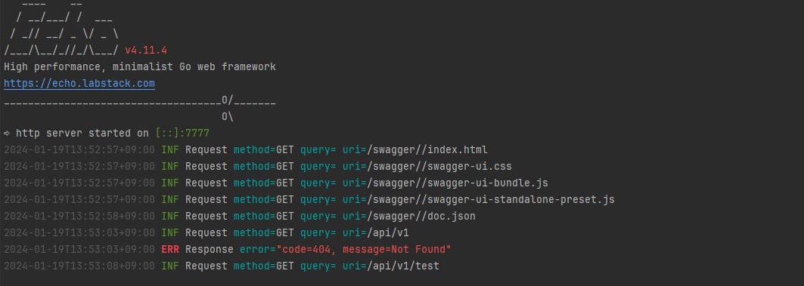

```
project_name
├── cmd : 프로젝트의 메인 애플리케이션들
    └── project_name
├── config : 설정 파일 템플릿이나 기본 설정들
├── docs : swagger
├── handler
├── logger
├── model
├── repository
├── route: http 라우팅을 구현한 패키지
    └── middleware
├── service
└── swagger
```

- go mod tidy
- log 형태 
  - 
- 실행방법
  - go run cmd/echo-project/main.go
- 응답예시
  - 
- database 구성
  - config/db.go에서 구성
  - 개별적으로 구성 [local mysql]